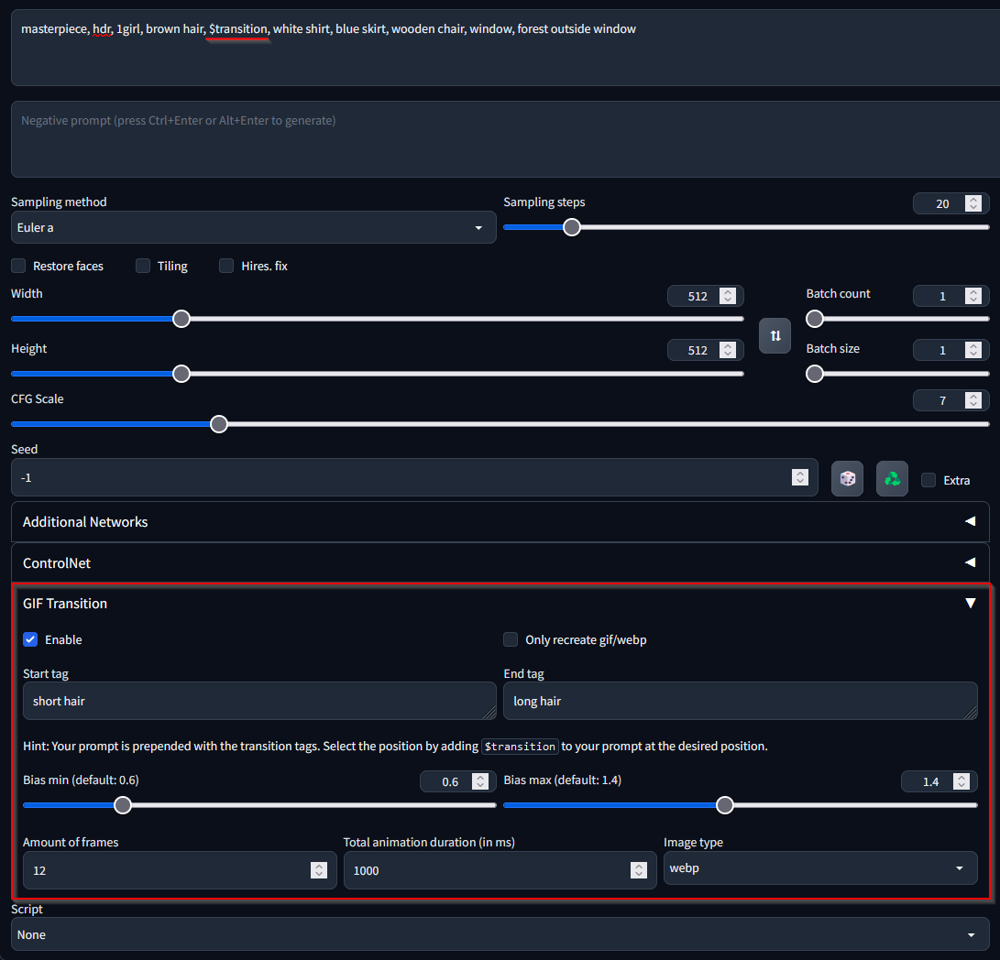

# Stable Diffusion txt2gif Transition

A [stable-diffusion-webui](https://github.com/AUTOMATIC1111/stable-diffusion-webui) addon to generate gifs with a transition.

## Example Result

## Install

1. Open "Extensions" tab
2. Click on "Install from URL"
3. Copy `https://github.com/gmasil/sd-webui-gif-transition.git` into "URL for extension's git repository"
4. Click on "Install"
5. Under "Installed" click on "Apply and restart UI"

## Usage

You can add two tags/words that are gradually transitioned between. The minimum and maximum bias of the tags have an impact on the amount of change from first to last frame. Then you can select the amount of frames you want to generate and the total duration of the animation in ms.

The settings above will generate a gif with 12 frames and a total animation length of 1.2 seconds.

The prompt of the first frame will be prepended by `(short hair:1.4), (long hair: 0.6)` and the last frame by `(short hair:0.6), (long hair: 1.4)` with a linear transition in between the frames.

## Transition Multiple Tags

Multiple tags seperated by comma are supported as well:

Here as a start tag `cute face, blue eyes` is used, end tag is `demon, red eyes`.
